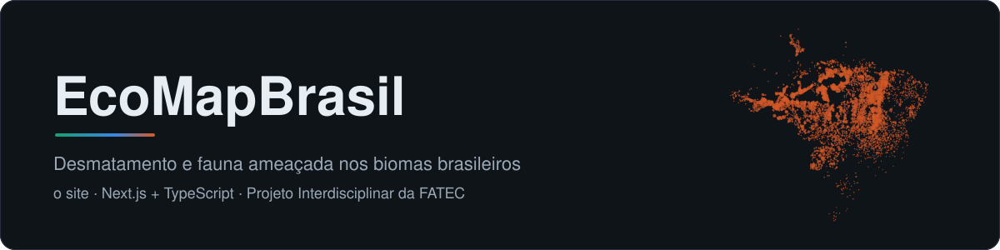
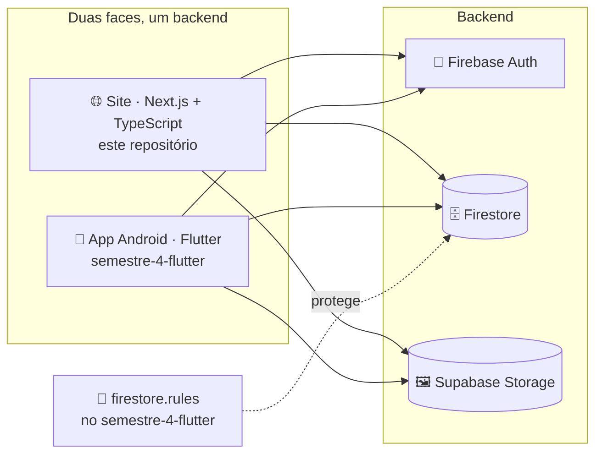

<p align="center">
  
</p>

<p align="center">
  
  
  
  
  
  
</p>

O **EcoMapBrasil** mostra num lugar só **onde** o desmatamento acontece nos biomas
brasileiros, **quais espécies** estão ameaçadas e o que dá para fazer a respeito. Este
repositório é **o site**, no 4º semestre: o porte da
[versão React do 3º semestre](https://github.com/ecomap-devs/semestre-3-react) para
**Next.js com TypeScript**, exportado como site estático e publicado no Firebase Hosting.

O app Android é o [semestre-4-flutter](https://github.com/ecomap-devs/semestre-4-flutter).
Os dois usam o mesmo backend, então a conta é a mesma e uma avaliação feita no celular
aparece no site.

> [!NOTE]
> **As três telas do React estão portadas** (Início, Mapa e Animais, com login e
> avaliações), com a mesma interface e os defeitos conhecidos corrigidos, e o site está
> no endereço principal desde 01/10/2026: **[ecomapbrasil-17756.web.app](https://ecomapbrasil-17756.web.app)**.

## 🧭 Onde este repositório entra



## 🛠️ Stack

| Camada | Escolha | Por quê |
|---|---|---|
| **Framework** | Next.js 16 (App Router) · React 19 | Cada página sai como HTML pronto no build, e não como uma `div` vazia montada por JS |
| **Linguagem** | TypeScript `strict` | Decidido em 30/09/2026, no início do porte, que é quando trocar custa menos |
| **Estilo** | Estilo inline, como no React · Tailwind 4 só como base | O porte manteve o visual idêntico; o Tailwind entra pelo reset de estilos |
| **Ícones** | Font Awesome 6, pelo npm | O React carregava de um CDN |
| **Mapa** | `leaflet` | O mesmo Leaflet do React, agora pelo npm e com versão fixa (o React baixava do unpkg sem versão) |
| **Conta e dados** | `firebase` (Auth, Firestore) | Login e avaliações em tempo real |
| **Imagens** | `@supabase/supabase-js` | Fotos das espécies e avatares |
| **Hospedagem** | Firebase Hosting, exportação estática | Plano gratuito, e é o único que serve o endereço `web.app` |

## 🚀 Como rodar

> Pré-requisito: Node.js 24.

```bash
git clone https://github.com/ecomap-devs/semestre-4-nextjs.git
cd semestre-4-nextjs
npm install

cp .env.example .env.local     # e preencha os valores
npm run dev                    # http://localhost:3000
```

| Comando | O que faz |
|---|---|
| `npm run dev` | Servidor de desenvolvimento |
| `npm run lint` | ESLint |
| `npm run typecheck` | Gera os tipos das rotas e roda o `tsc` |
| `npm run build` | Exportação estática em `out/`, **sem precisar de credencial** |

> [!IMPORTANT]
> Tudo no `.env.local` é `NEXT_PUBLIC_*` e vai para o navegador: são chaves públicas de
> cliente. Quem protege o dado são as Firestore Rules e o RLS do Supabase. Sem o
> `.env.local`, o site compila, e o primeiro uso do Firebase lança um erro dizendo
> exatamente qual variável falta.

## 🏗️ Exportação estática

`next build` gera um HTML por rota em `out/`, e o Firebase Hosting serve esses arquivos.
Não há servidor, então ficam de fora route handlers, `proxy.ts`, server actions, ISR e o
otimizador do `next/image`. Para este site não custa nada: login, avaliações e mapa já
rodavam no navegador no React.

<details>
<summary>Como o Hosting está configurado (<code>firebase.json</code>)</summary>

| Regra | Por quê |
|---|---|
| `cleanUrls: true` | `/mapa` serve `mapa.html` |
| `trailingSlash: false` | `/mapa/` redireciona para `/mapa` |
| `**` com `no-cache` | O HTML é revalidado a cada visita: deploy novo aparece na hora |
| `/_next/static/**` com `immutable` por um ano | O nome desses arquivos tem hash e muda a cada build |

A ordem importa: **a última regra que casa vence**. E `immutable` só vale em arquivo com
hash no nome. O app Flutter marcou `main.dart.js` assim, e os visitantes ficaram presos
na interface antiga.

Rotas, `cleanUrls`, `trailingSlash` e o 404 foram conferidos no emulador do Hosting. Os
cabeçalhos de cache **não**: o emulador ignora a seção `headers`. Confira no primeiro
deploy:

```bash
for u in / /mapa /_next/static/; do
  echo -n "$u  "; curl -sI "https://ecomapbrasil-17756.web.app$u" | grep -i '^cache-control'
done
```

</details>

## 🔄 CI e deploy

| Workflow | Quando | O que faz |
|---|---|---|
| **CI** | Push ou PR na `main` | Lint, tipos, build e confere que cada rota virou HTML. Não usa secret |
| **Preview do PR** | PR aberto | Build com as credenciais e deploy num canal de preview com URL própria, que expira em 7 dias |
| **Deploy para produção** | Merge na `main` (ou na mão) | Publica no endereço principal |

O build com credenciais (`.github/scripts/build-com-credenciais.sh`) recusa secret vazio
e, depois do build, confere que o `projectId` do Firebase entrou no JavaScript gerado.
As duas guardas foram testadas nos dois sentidos.

<details>
<summary>Secrets do repositório</summary>

Os mesmos nomes do semestre-4-flutter, para quem já configurou um configurar o outro:

| Secret | De onde vem |
|---|---|
| `FIREBASE_API_KEY_WEB` · `FIREBASE_APP_ID_WEB` | O app **web** no console do Firebase |
| `FIREBASE_MESSAGING_SENDER_ID` · `FIREBASE_PROJECT_ID` · `FIREBASE_AUTH_DOMAIN` · `FIREBASE_STORAGE_BUCKET` | Configuração do SDK no console do Firebase |
| `SUPABASE_URL` · `SUPABASE_PUBLISHABLE_KEY` | Project Settings → API Keys no Supabase |
| `FIREBASE_SERVICE_ACCOUNT_ECOMAPBRASIL_17756` | Conta de serviço com permissão de deploy no Hosting. Sem ela, o preview avisa e pula |

</details>

## 🔁 O que o porte corrigiu

A interface é a mesma do React, conferida lado a lado em capturas de tela no desktop e no
celular. O que mudou foi de propósito:

<details>
<summary>Defeitos do React corrigidos</summary>

| Onde | No React | Agora |
|---|---|---|
| Login | O texto digitado nos campos era branco sobre fundo branco | Legível |
| Cadastro | Gravava o e-mail em `usuarios/{uid}` (LGPD) | Não grava, como o Flutter |
| Avatar | Usava a `anon` key do Supabase, desativada em 08/09/2026 | `sb_publishable_` |
| Avaliações | Baixava a coleção inteira; falha no envio deixava o botão em "Enviando..." | `limit()`, média e total agregados no servidor, erro tratado, hora do servidor |
| Avaliações | Entre 28 e 29 dias aparecia "há 0 mês" | "há 4 semanas" |
| Mapa | Clicar em São Paulo abria a ficha do Cerrado | Escolhe o bioma mais específico, como o Flutter |
| Mapa | Legenda com "Limites Estaduais", sem camada correspondente | Só o que está desenhado |
| Mapa | Leaflet do unpkg sem versão | Do npm, com versão fixa |
| Início | Carregava a MapLibre do unpkg para um mapa que não existia na página | Removido |
| Início | "Compartilhar" não fazia nada; "Baixar Dados" apontava para um `.zip` inexistente | Compartilha (ou copia o link); baixa o GeoJSON dos alertas |
| Início | A âncora de cada seção parava debaixo do cabeçalho fixo | Desconta o cabeçalho |
| Início | Equipe com quatro pessoas | As cinco |
| Início e rodapé | Cinza sobre verde-escuro quase ilegível; contato e redes com texto de exemplo e links `#` | Contraste corrigido; só o que é real |
| Animais | Busca exigia acento ("onca" não achava a onça) | Sem acento e sem caixa |
| Animais | Cards piscavam ao entrar; ficha sem Esc e com o fundo rolando | Corrigido |
| Imagens | Foto que não carregava virava ícone quebrado | Imagem reserva |
| Geral | A página ficava em branco até o Firebase responder | A página aparece na hora; só o botão de login espera |

</details>

## 🔀 A troca de endereço (feita em 01/10/2026)

Decidido em 30/09/2026: o site fica com o endereço principal
(`ecomapbrasil-17756.web.app`) e o Flutter vira só o app Android. A troca foi feita em
01/10/2026:

1. ✅ **Deploy para produção** rodado na mão, ainda com confirmação.
2. ✅ Site conferido: as três rotas com `no-cache`, `_next/static/` imutável, os
   arquivos do Flutter (`main.dart.js`, `flutter_bootstrap.js`) respondendo 404, e as
   avaliações reais carregando no navegador.
3. ✅ O `deploy.yml` passou a rodar a cada merge na `main`.
4. ✅ No semestre-4-flutter saíram o deploy no Hosting, o preview por PR, o build web da
   CI e o check `Build web` da proteção da `main`.

Quem ficou preso na interface antiga do Flutter se solta sozinho: o `/` tinha cache de
uma hora, e o HTML novo não pede mais o `main.dart.js`. O service worker do Flutter já
se desregistrava sozinho.

Se precisar voltar uma versão, o Firebase Hosting guarda o histórico: Console →
Hosting → histórico de lançamentos → Reverter.

## 🤝 Contribuindo

As regras estão no **[AGENTS.md](AGENTS.md)**: credenciais, o que a exportação estática
proíbe, como validar dado do Firestore e o **checklist do porte**, com os defeitos do
React que o Flutter já corrigiu e que não devem voltar. Valem para os cinco do grupo e
para qualquer assistente de IA.

## 👥 Equipe

**Vinicius** · **Bruno** · **Cesar** · **João Flávio** · **João Gabriel**

## 📄 Licença

[MIT](LICENSE). Projeto acadêmico, sem fins lucrativos.
